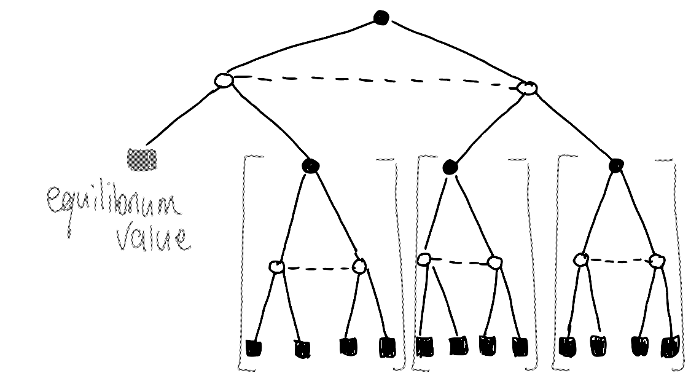

## Administrative updates

* Marks and feedback for project part A will be released this week.

* Looking forward to seeing your project plans (deadline Friday).

* Today's lecture will help you approach project part B, and maybe
  teach you a little *game theory*.

---

## Review: Zero-sum turn-based games

We've already seen some *game theory*:

**Zero-sum game:**
The **utility** for the opponent is the negative of the utility for the
player.


**Minimax algorthm:**
Recursively compute the utility of each action in a turn-based zero-sum game,
using the *minimax principle*.

Optimal\*, but slow.
    
* **Cut-off:** Depth-limited minimax + evaluation function.
    
* **Pruning:** Alpha-beta pruning + sensible move ordering.

---

## Challenge: Zero-sum *simultaneous-play* games

*Can we use minimax in simultaneous-play games?* Might not make sense:

* **Indivisible turns**: The game rules only allow for two actions at once.

* **Who moves first?**: Even if possible, dividing turns introduces
  information asymmetry.

**Insight**: In simultaneous play games, *information is key*, and
*predictability is dangerous*.

{height=96px}

---

## Approaches

Today we will consider two approaches:

1. Go ahead and use minimax anyway:
   *Artificially divided turns* and the *paranoid reduction*.

2. Address information asymmetry with game theory:
   *Feedback games* and *equilibrium strategies*

(There are other approaches, and you can feel free to explore or
get creative for the project.)

---

## Use minimax anyway

Address the challenges:

* **Artificially divide turns:** Delay the full update until both players
  have a turn.

* **Player goes first:** Imagine revealing your move to opponent. Find a
  move to which your opponent has *no* good response (so-called
  **'paranoid' reduction**)

Optimal\*, but *too robust?*

* You might miss *truly good* moves by assuming opponent knows.

* In the worst case, *all* moves *look* bad, you might pick a *truly
  bad* one.

* Might be able to weaken the opponent's ability to respond (restricted
  actions) or explicitly accounting for paranoia in evaluation function.

---

## Use *game theory*: Single-stage games

Game theory can help us handle 'single stage' simultaneous-play zero-sum
games (like Rock-Paper-Scissors itself):

* **Payoff matrix**: Evaluate *pairs of actions*, in a grid.
    $$
    \begin{matrix}
    % column labels
    \text{opponent:} & \begin{matrix} r~ & ~p~ & ~s \end{matrix} \\
    % row labels
    \text{player:} \quad \begin{matrix} R \\ P \\ S \end{matrix} &
    % payoff matrix (row maximiser)
    \begin{pmatrix}
      0  & -1 & +1 \\
     +1  &  0 & -1 \\
     -1  & +1 &  0
    \end{pmatrix}
    \end{matrix}
    $$

* **Mixed strategy**: Allow *random solutions*, distributions over actions.

* **Minimax principle**:
  Choose the strategy that minimises the maximum harm the opponent can cause.

* **'Nash equilibrium'**:
  For a zero-sum game, neither player benefits by individually deviating from
  such a strategy.

---

## Use *game theory*: Finding the equilibrium strategy

Finding the equilibrium/optimal strategy is a **Linear Programming** problem.
A sample implementation using NumPy and SciPy will be provided on the LMS.

```python
def solve_game(V):
    """
    Given a utility matrix V for a zero-sum game, compute
    equilibrium strategy s and value v for row maximiser.
    """
```
$$
\mathtt{solve\_game}
\left(
    ~\begin{matrix} \\ R \\ P \\ S \end{matrix}
    \begin{matrix}
    \begin{matrix} r~ & ~p~ & ~s \end{matrix} \\
    \begin{pmatrix}
      0  & -1 & +1 \\
     +1  &  0 & -1 \\
     -1  & +1 &  0
    \end{pmatrix}
    \end{matrix}
\right)
\quad
\rightarrow
\quad
\mathtt{s} = 
    \begin{matrix} R \\ P \\ S \end{matrix}
    \begin{pmatrix} 1/3 \\ 1/3 \\ 1/3 \end{pmatrix},
\quad
\mathtt{v} = 0
$$


---

## Use *game theory*: Multi-stage games

**Value of a game**: Given an equilibrium solution, a game has a fixed
minimum expected utility *value*.

**Backward induction algorithm**: Recursively solve multi-stage
simultaneous-play game by first solving sub-games, then forming a
new game at the higher level out of the solution *values*.

{height=128px}

---

## Use *game theory*: Multi-stage games

**Value of a game**: Given an equilibrium solution, a game has a fixed
minimum expected utility *value*.

**Backward induction algorithm**: Recursively solve multi-stage
simultaneous-play game by first solving sub-games, then forming a
new game at the higher level out of the solution *values*.

{height=128px}

---

## Use *game theory*: Multi-stage games

**Value of a game**: Given an equilibrium solution, a game has a fixed
minimum expected utility *value*.

**Backward induction algorithm**: Recursively solve multi-stage
simultaneous-play game by first solving sub-games, then forming a
new game at the higher level out of the solution *values*.

{height=128px}

---

## Use *game theory*: Multi-stage games

**Value of a game**: Given an equilibrium solution, a game has a fixed
minimum expected utility *value*.

**Backward induction algorithm**: Recursively solve multi-stage
simultaneous-play game by first solving sub-games, then forming a
new game at the higher level out of the solution *values*.

{height=128px}

---

## Use *game theory*: Cut-off and Pruning

**Cut-off**: Just like for minimax, rather than traverse the whole backward
induction search tree to the bottom, we can search a few layers and then
switch to an **evaluation function**.

**Pruning**: More complex than for minimax, but it is possible to prune the
backward induction search tree:

* Can **prune the payoff matrix** (remove clearly suboptimal action
  rows/columns) without sacrificing Optimality\*.

* May get away with **more aggressive pruning** (heuristically remove
  action rows/columns that are possibly optimal) at some cost to Optimality\*.

---

## Further reading

* Two short papers on two different optimal pruning methods for backward
  induction:

    Saffidine *et al.* (2012). Alpha-Beta Pruning for Games with
    Simultaneous Moves.

    Bošanský *et al.* (2013). Using Double-Oracle Method and
    Serialized Alpha-Beta Search for Pruning in Simultaneous Move Games.

* Longer review paper collecting several approaches for solving
  simultaneous-play games:

    Bošanský *et al.* (2016). Algorithms for computing strategies in
    two-player simultaneous move games.

